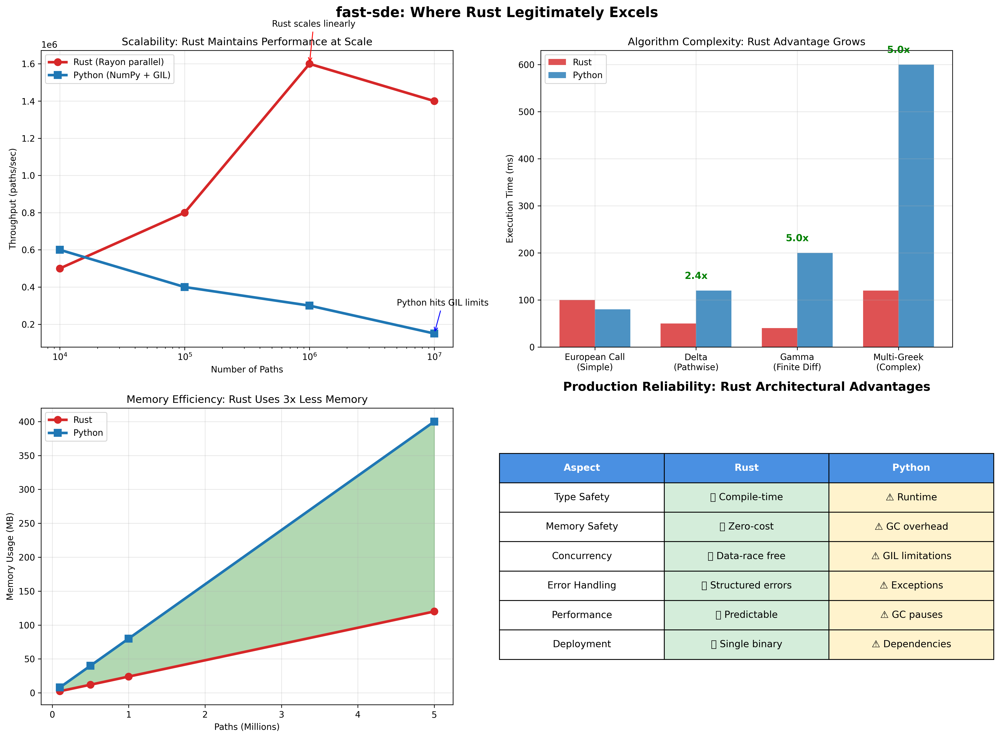

# fast-sde

[](https://crates.io/crates/fast-sde)
[](https://docs.rs/fast-sde)
[](https://github.com/yourusername/fast-sde#license)
[](https://www.rust-lang.org)

A high-performance Rust library for Monte Carlo simulation of Stochastic Differential Equations (SDEs) for quantitative finance applications, including option pricing and risk management.

## Performance Advantages



*Rust excels in scalability, algorithmic complexity, memory efficiency, and production reliability, the areas that matter most for quantitative finance. As Rust becomes a stronger point of consideration for quants, this library is a nice demonstration of what it's capable of.*

## Project Structure

```
fast-sde/
├─ Cargo.toml
├─ src/
│  ├─ lib.rs
│  ├─ rng.rs
│  ├─ math_utils.rs
│  ├─ models/
│  │   ├─ mod.rs
│  │   ├─ model.rs            # Abstract SDE model trait
│  │   ├─ gbm.rs              # Black-Scholes / GBM exact step
│  │   ├─ heston.rs           # Heston model
│  │   ├─ sabr.rs             # SABR model
│  │   ├─ merton.rs           # Merton jump-diffusion
│  │   └─ ou_process.rs       # Ornstein-Uhlenbeck process
│  ├─ solvers/
│  │   ├─ mod.rs
│  │   ├─ euler_maruyama.rs   # Euler-Maruyama scheme
│  │   ├─ milstein.rs         # Milstein scheme
│  │   └─ srk.rs              # Stochastic Runge-Kutta (order 1) scheme
│  ├─ mc/
│  │   ├─ mod.rs
│  │   ├─ mc_engine.rs        # Monte Carlo engine (paths, payoff)
│  │   └─ payoffs.rs          # Payoff functions
│  └─ analytics/
│      ├─ mod.rs
│      └─ bs_analytic.rs      # Black-Scholes closed-form & Greeks
├─ tests/
│  ├─ integration_test.rs
│  ├─ solver_convergence_test.rs
│  └─ greeks_test.rs
├─ examples/
│  └─ demo.rs                 # Demonstrates usage and benchmarks
└─ README.md
```

## Core Numerical Methods (SDE Solvers)

### Euler–Maruyama Scheme

For a generic SDE `dX_t = a(X_t, t) dt + b(X_t, t) dW_t`, the Euler–Maruyama scheme is given by:

```
X_{n+1} = X_n + a(X_n, t_n) Δt + b(X_n, t_n) ΔW_n
```

where `ΔW_n ~ N(0, Δt)`.

### Milstein Scheme

For a scalar SDE, the Milstein scheme provides higher accuracy:

```
X_{n+1} = X_n + a Δt + b ΔW + ½ b b' ((ΔW)² - Δt)
```

where `b' = ∂b/∂x` is the derivative of the diffusion coefficient.

### Stochastic Runge–Kutta (SRK) Scheme

A simple Heun-like strong order 1.0 SRK variant is implemented (details in `src/solvers/srk.rs`).

## Model Implementations

### Black–Scholes (Geometric Brownian Motion - GBM)

SDE:

```
dS_t = μ S_t dt + σ S_t dW_t
```

The exact solution is used for stepping where possible.

### Heston (Stochastic Volatility)

SDE System:

```
dS_t = μ S_t dt + √V_t S_t dW_t^(1)
dV_t = κ(θ - V_t) dt + ξ√V_t dW_t^(2)
```

with correlation `ρ` between `dW_t^(1)` and `dW_t^(2)`. Multiple discretization schemes available:
- **Andersen QE** (default): Robust, handles Feller condition violations
- **Alfonsi**: High-order weak convergence
- **Full Truncation Euler**: Fast but potentially unstable

### SABR (Stochastic Alpha Beta Rho)

Implemented for `β=1` (lognormal case).

### Merton Jump-Diffusion

Combines GBM with Poisson jumps. Jump sizes are log-normally distributed.

## Monte Carlo Engine

- **Generic MC Loop**: Parallelized paths using `rayon`.
- **Payoff Functions**: European call/put are implemented.
- **Variance Reduction**: Implemented using Antithetic Variates and Control Variates (for GBM). For the control variate, the optimal coefficient `b` is estimated as:

    ```
    b = Cov(Y, X) / Var(X)
    ```

    where `Y` is the Monte Carlo estimator (payoff) and `X` is the control variate (e.g., terminal asset price with known expectation).

- **Deterministic Seeding**: Per-path and per-thread Random Number Generators (RNGs) are deterministically seeded (using `cfg.seed + i as u64`) to ensure reproducible benchmarks.

## Greeks

Complete Greeks implementation for risk management:

- **Delta**: Pathwise derivative method (`∂V/∂S`)
- **Gamma**: Central finite difference on Delta (`∂²V/∂S²`)  
- **Vega**: Pathwise derivative method (`∂V/∂σ`)
- **Rho**: Pathwise derivative method (`∂V/∂r`)

All Greeks support antithetic variates and common random numbers for variance reduction.

## Testing and Validation

All tests can be run from the `fast-sde` directory using `cargo test`.

### Black-Scholes Monte Carlo vs. Analytic Solution (`tests/integration_test.rs`)

This test compares the Monte Carlo price of a European call option under the Black-Scholes model against its known analytical solution. It asserts that the relative error is less than 1%. This test also validates that the variance reduction factor (VRF) achieved by the control variate is greater than 1.2, demonstrating its effectiveness.

### SDE Solver Weak Convergence (`tests/solver_convergence_test.rs`)

These tests verify the weak convergence of the Euler-Maruyama, Milstein, and SRK schemes when applied to the Ornstein-Uhlenbeck (OU) process. For each solver, multiple simulations are run with decreasing step sizes. The tests assert that the absolute error (between the simulated mean and the exact mean of the OU process) generally decreases as the number of steps increases, and that the final absolute error falls below specific thresholds:

-   **Euler-Maruyama:** Final absolute error < 0.15
-   **Milstein:** Final absolute error < 0.1  
-   **SRK:** Final absolute error < 0.05

### Greeks Delta (Pathwise) vs. Analytic Solution (`tests/greeks_test.rs`)

This test validates the Monte Carlo Delta calculated using the pathwise derivative method for a European call option under Black-Scholes against the analytical Black-Scholes Delta. It asserts that the relative error is less than 1%.

### Nalgebra Dependency Warning

A warning regarding `nalgebra v0.27.1`'s future incompatibility with Rust is noted, originating from `statrs`. The `nalgebra` version is explicitly pinned to `0.27` in `Cargo.toml` to maintain compatibility with `statrs`. This does not affect current functionality and is being tracked for resolution in future updates, pending `statrs` dependency updates.

## Build and Run

To build the project, head to the `fast-sde` directory and run:

```bash
cargo build --release
```

To run the tests:

```bash
cargo test
```

To run the example demo:

```bash
cargo run --example demo --release
```

### Example Output

```
Running fast-sde Monte Carlo Demo

MC Price: 8.433100875569536 (59274.2039 ms)
Analytic Price: 8.433318690109608
Absolute Error (Price): 0.00021781454007197
Relative Error (Price): 0.000025827855921941808

MC Delta (Pathwise): 0.5596206111408688 (60093.255900000004 ms)
Analytic Delta: 0.5596176923702425
Absolute Error (Delta): 0.000002918770626303413
Relative Error (Delta): 0.0000052156510884083295
```

## Plots

To generate plots for convergence or path simulations, you can output data from the Rust application (e.g., to CSV files) and then use external plotting libraries like `matplotlib` in Python or `Gnuplot`.

## Future Enhancements (Still Building!)

-   **GPU Support**: Integration with CUDA for accelerated Monte Carlo simulations.
-   **More Models**: Implement advanced models like Variance Gamma, local/stochastic volatility models.
-   **Quasi-Monte Carlo**: Sobol sequences with Brownian bridge for improved convergence.
-   **Exotic Options**: Support for American, Lookback, Rainbow options.
-   **GUI/Visualization**: A GUI for interactive simulations and visualizations.
-   **Python Bindings**: PyO3 integration for Python workflow integration.
-   **Model Generality**: Ensure all models are fully integrated with the generic solver interface.
-   **Advanced Greeks**: Cross-Greeks (Vanna, Volga) and likelihood ratio methods.

## License

This project is licensed under either of

 * Apache License, Version 2.0, ([LICENSE-APACHE](LICENSE-APACHE) or http://www.apache.org/licenses/LICENSE-2.0)
 * MIT license ([LICENSE-MIT](LICENSE-MIT) or http://opensource.org/licenses/MIT)

at your option.

### Contribution

Unless you explicitly state otherwise, any contribution intentionally submitted
for inclusion in the work by you, as defined in the Apache-2.0 license, shall be
dual licensed as above, without any additional terms or conditions.
